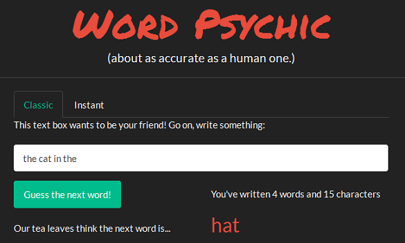

Word Psychic
========================================================
author: Melissa Tan
font-import: http://fonts.googleapis.com/css?family=Permanent+Marker
font-family: 'Permanent Marker'
date: April 2015
transition: rotate
css: custom.css

A word prediction app ([link](http://melissatan.shinyapps.io/word_psychic))

Made for Coursera data science specialization, Swiftkey capstone project.

App description
========================================================

The app lets the user type in a phrase. It predicts
the most likely next word, based on frequently
occurring phrases (n-grams).

__How it was made:__

I used 2-grams to 5-grams,
drawn from ~12,000 lines of English from blogs, news articles and Twitter.

I cleaned the text to remove things like punctuation (except apostrophes).
I also replaced all words that appeared only once
with a placeholder, `unk`. These could be typos or words like "zzzzzz".

App function and instructions
========================================================
__How the app works:__

1. User inputs a phrase (as many words as she wants)
2. App looks at the last 1-4 words in phrase
3. App checks the database for phrases that match
4. App gathers all the possible predicted words and displays
the most likely one

__How to use the app:__

* Classic mode: Type into the text field, and click the button
to see the predicted next word.
* Instant mode: Type into the text field, and wait. The app
automatically displays the predicted next word.

Behind the scenes: Algorithm used
========================================================
The algorithm used is _Stupid Backoff_, described in Brants et al, 2007 ([link, see section 4](http://www.aclweb.org/anthology/D07-1090.pdf)).
I chose this because it is inexpensive and loads fast, while
performing nearly as well as Kneser-Ney smoothing -- which is quite good.

The algo gives each candidate word a score, based on its n-gram frequency.
Mathematically, let
$Score = \begin{cases} \frac {freq(w_i)_{n=k+1}} {freq(w_{i-k}^{i-1})_{n=k+1}} & \text{if } freq(w_{i-k}^i)_{n=k+1} > 0 \\ \alpha \frac {freq(w_i)_{n=k}} {freq(w_{i-(k-1)}^{i-1})_{n=k}} & \text{otherwise} \end{cases}$

Hypothetical example: user types `cat in the`. One possible next word is `hat`.
We look in the 4-gram first (`n = 4`). The score for `hat` is given by:
$$Score(\text{"hat"}) = \begin{cases} \frac {freq(\text{"hat"})_{n=4}} {freq(\text{"cat in the"})_{n=4}} & \text{if } freq(\text{"cat in the hat"})_{n=4} > 0 \\ \alpha \frac {freq(\text{"hat"})_{n=3}} {freq(\text{"in the"})_{n=3}} & \text{otherwise} \end{cases}$$

Note that the score depends on the _relative_ frequency, which is
also the Maximum Likelihood Estimate (MLE), in this case.

Algorithm walk-through example
========================================================

User input: `"The CAT, in the ?"`. What the algo does is:

* Cleans up and standardizes the input, turning it into: `"the cat in the"`.

* Check 5-gram data for all occurrences of `the cat in the *`, where * denotes
any word. Similarly, check 4-gram data for `cat in the *`, check 3-gram data for `in the *`, check 2-gram data for `the *`. Make a list of all the `*` candidate words.

* For each word, find maximum likelihood estimate (MLE) in the
corresponding n-gram, compute overall score (set $\alpha$ = `0.4`), and produce a score table. Below are the first 3 rows of an example score table, which show that `hat` followed 100% of the `the cat in the` instances in the 5-gram.

|nextword | n5.MLE| n4.MLE| n3.MLE| n2.MLE| score|
|:--------|------:|------:|------:|------:|-----:|
|hat      |    100|    100|      0|      0| 100.0|
|unk      |      0|      0|      3|      4|   0.5|
|first    |      0|      0|      2|      1|   0.3|

* Remove any `unk` rows. (since `unk` was  a placeholder for words that only appeared once)

* Output the word with the top score. If there are multiple
words with the same top score, randomly pick one. If user turns on
_safe mode_ and the output word is a profanity, censor the output.

