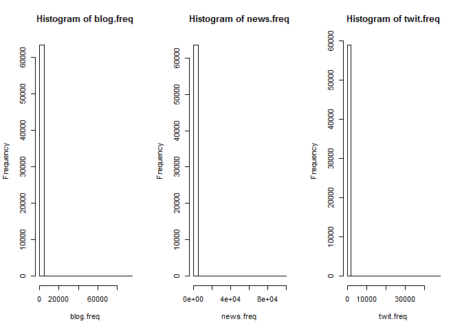
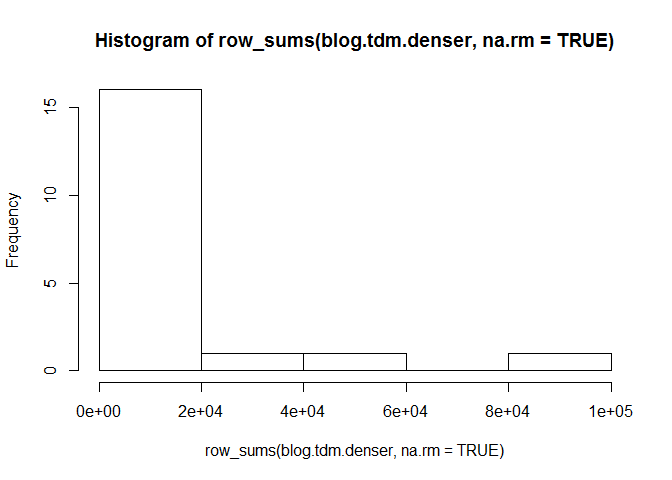

# Swiftkey capstone milestone report
Melissa Tan  
Sunday, March 22, 2015  


## Introduction

This is a milestone report for a data science capstone project that involves next-word prediction.The goal for the overall project is to write an algorithm to predict the next word that will appear after a given phrase. For example, "_the cat in the_" might be followed by "_hat_". The algorithm will eventually be made into an app. 

In this report, I'll go through my exploratory analysis of 3 texts -- from blogs, news sites, and Twitter -- that were collected from the web. I'll be using these 3 texts later on to build my word prediction algorithm, so it might be useful to explore them in advance.

## Executive summary 

What I found was that in each of the 3 texts, the average words per sentence differed. 
Also, there was a huge number of words that appeared only once. The most common words were the usual suspects, such as "and" and "the".

Note: To keep the report brief and concise, I've put most of my R code in the Appendix.

## Download data

The dataset must be downloaded from a link given in the course website, [https://d396qusza40orc.cloudfront.net/dsscapstone/dataset/Coursera-SwiftKey.zip](https://d396qusza40orc.cloudfront.net/dsscapstone/dataset/Coursera-SwiftKey.zip). Get the file and unzip. (To keep things cleaner in my current working directory, I've chosen to unzip into the directory right above it, which is called the parent directory.)


The unzipped file contains a directory called `final`, then a subdirectory called `en_US`, which contains the texts that I will analyze. Here, I use a system command called `ls` to print a list of all the files inside the `en_US` folder.


```r
setwd("../final/en_US") # go into the /final/en_US folder
system("ls")            # list all the files inside this folder
```

As you can see, there are 3 text files. I'll be exploring all of them.     
* `en_US.blogs.txt` - text from blog posts
* `en_US.news.txt` - text from news articles posted online 
* `en_US.twitter.txt` - tweets on Twitter

## Basic summary of text files

Here's a word and line count for each of the three datasets. 


              Total word count   Total line count   Number of words in longest line   Average words per line
-----------  -----------------  -----------------  --------------------------------  -----------------------
blog.stats            37334114             899288                             40833                       42
news.stats            34365936            1010242                             11384                       34
twit.stats            30359852            2360148                               173                       13

## Extract a random subsample of each text

Since the datasets are too large for my laptop memory to handle, I wrote a function, `SampleTxt()`, that extracts a random subsample from each of the source texts. The function essentially flips a coin to decide whether to copy a particular line from the source text to the subsample. At the end, I save each subsample in a `.txt` file in my current working directory, so that I don't have to keep re-generating it.


I extract about 5% (in terms of number of lines) from the original source text into each random subsample.


File names for the 3 subsamples I made:        
* `blog.sample.txt` - contains about 5% of original blog text       
* `news.sample.txt` - contains about 5% of original news text       
* `twit.sample.txt` - contains about 5% of original tweets       

## Basic summary of subsample

Count words and lines in subsamples to see how they compare with the source text. Although the subsamples have markedly fewer words and lines, the average words per line for each text are roughly similar.


                     Sample word count   Sample line count   Words in longest line   Avg words per line
------------------  ------------------  ------------------  ----------------------  -------------------
blog.sample.stats              1884523               45506                   12403                   41
news.sample.stats              1727402               51087                    2363                   34
twit.sample.stats              1536112              119260                     371                   13

## Import and clean subsample

Read in each of the subsample txts. 


```r
blog.mini <- readLines("./blog.sample.txt")  # imports txt as character vector
news.mini <- readLines("./news.sample.txt")
twit.mini <- readLines("./twit.sample.txt")
```

R has a text mining package called `tm`, which is able to turn the text into a special object called a "corpus" for easier analysis and navigation. 

Using the package, I make a corpus out of each of the 3 subsamples. I've printed out an arbitrarily chosen line of text from the blog sample below, to show what a line looks like in its raw form.


```r
library(tm)
# build a corpus, from a character vector
blog.corpus.raw <- Corpus(VectorSource(blog.mini))
news.corpus.raw <- Corpus(VectorSource(news.mini))
twit.corpus.raw <- Corpus(VectorSource(twit.mini))
# this displays an arbtrarily chosen line from each corpus
inspect(blog.corpus.raw[42])
```

```
## <<VCorpus (documents: 1, metadata (corpus/indexed): 0/0)>>
## 
## [[1]]
## <<PlainTextDocument (metadata: 7)>>
## “I’m sorry my transporter was malfunctioning, alright what’s the big emergency?
```

```r
inspect(news.corpus.raw[43])
```

```
## <<VCorpus (documents: 1, metadata (corpus/indexed): 0/0)>>
## 
## [[1]]
## <<PlainTextDocument (metadata: 7)>>
## Another co-worker, Cindy Backer of High Ridge, Mo., nominated the four alert security officers.
```

```r
inspect(twit.corpus.raw[44])
```

```
## <<VCorpus (documents: 1, metadata (corpus/indexed): 0/0)>>
## 
## [[1]]
## <<PlainTextDocument (metadata: 7)>>
## Oh we out here for 's birthday..see you soon!! RT : ..now on to shoot for "Who needs miami b*tch!"
```

Now I start to clean up the three corpora (plural of "corpus"), which I'll do using a function I wrote called `cleanCorpus()`. It performs the following steps:

1. Convert text to lowercase

2. Remove URLs by deleting every string of characters that starts with "http"

3. Remove all words containing numbers, e.g. "007", "1st", "b2c", "d20", "24/7"

4. Convert all smart quotes, e.g. `'`, to straight quotes e.g. `'`.

5. Handle punctuation: there's a standard `removePunctuation()` function in the `tm` package, which removes everything found in the `[:punct:]` POSIX class, including hyphens and apostrophes. However, I still want to keep some intra-word punctuation marks, e.g. `mother-in-law`, `isn't`. So I wrote my own functions to remove all punctuation except `-`, `'`, and `*`.

6. Intra-word hyphens: Keep these, and remove the rest. e.g. `my mother-in-law visited--i was absolutely -thrilled-!` gets converted to `my mother-in-law visited i was absolutely thrilled!` 

7. Intra-word apostrophes: Keep, to distinguish between e.g. `its` and `it's`. I would like to keep leading apostrophes e.g. `'Twas` too, but I can't because it's difficult to distinguish between those and the start of a sentence. So my code will leave `can't` unchanged, but will turn `'hello world'` into `hello world`, and similarly will turn `'twas` into `twas`. 

8. Intra-word asterisks: These are often used when people are swearing e.g. "b*tch". Keep them for now, but later in the prediction algorithm I'll remove profanity from the output.

9. Compress extra whitespace

10. Trim leading and trailing whitespace.


So after all the changes, the sample lines we saw displayed above now look different. See the new versions below.


```r
blog.corpus <- cleanCorpus(blog.corpus.raw)
news.corpus <- cleanCorpus(news.corpus.raw)
twit.corpus <- cleanCorpus(twit.corpus.raw)
# the same lines I arbitrarily picked earlier
inspect(blog.corpus[42])
```

```
## <<VCorpus (documents: 1, metadata (corpus/indexed): 0/0)>>
## 
## [[1]]
## <<PlainTextDocument (metadata: 7)>>
## i'm sorry my transporter was malfunctioning alright what's the big emergency
```

```r
inspect(news.corpus[43])
```

```
## <<VCorpus (documents: 1, metadata (corpus/indexed): 0/0)>>
## 
## [[1]]
## <<PlainTextDocument (metadata: 7)>>
## another co worker cindy backer of high ridge mo nominated the four alert security officers
```

```r
inspect(twit.corpus[44])
```

```
## <<VCorpus (documents: 1, metadata (corpus/indexed): 0/0)>>
## 
## [[1]]
## <<PlainTextDocument (metadata: 7)>>
## oh we out here for s birthday see you soon rt now on to shoot for who needs miami b*tch
```

## Visualize word frequency and find word associations

To find word frequencies, we can again use the `tm` package. The very first thing we need to do is turn the corpus into something called a "term-document matrix" (TDM for short).

Technically, a TDM is a matrix that describes the frequency of words found in a collection of documents (source: [Wikipedia](http://en.wikipedia.org/wiki/Document-term_matrix)). The rows correspond to each word, and the columns correspond to each document. (A document-term matrix has it the other way round, and is simply the transpose of the TDM.) 

For our TDM, note that every line in the blog, news, and Twitter subsamples is considered one document.  


```r
blog.tdm <- TermDocumentMatrix(blog.corpus)
news.tdm <- TermDocumentMatrix(news.corpus)
twit.tdm <- TermDocumentMatrix(twit.corpus)
blog.tdm
```

```
## <<TermDocumentMatrix (terms: 63493, documents: 45506)>>
## Non-/sparse entries: 1194628/2888117830
## Sparsity           : 100%
## Maximal term length: 59
## Weighting          : term frequency (tf)
```

```r
news.tdm
```

```
## <<TermDocumentMatrix (terms: 63536, documents: 51087)>>
## Non-/sparse entries: 1218646/3244644986
## Sparsity           : 100%
## Maximal term length: 29
## Weighting          : term frequency (tf)
```

```r
twit.tdm
```

```
## <<TermDocumentMatrix (terms: 58964, documents: 119260)>>
## Non-/sparse entries: 1108918/7030937722
## Sparsity           : 100%
## Maximal term length: 93
## Weighting          : term frequency (tf)
```

We see that there's an indicator called "sparsity", which essentially gauges how many zeroes there are. A sparse matrix is a matrix with a lot of zeroes. Sparsity in the subsample texts is very high. 

To illustrate this, let's look at an example. Let's search for the word "winter" in the blog subsample text, plus the next 4 words alphabetically. And let's restrict this to the first 10 lines. Many zeroes appear.


```r
i <- which(dimnames(blog.tdm)$Terms == "winter")
inspect(blog.tdm[i+(0:5), 1:10])
```

```
## <<TermDocumentMatrix (terms: 6, documents: 10)>>
## Non-/sparse entries: 1/59
## Sparsity           : 98%
## Maximal term length: 13
## Weighting          : term frequency (tf)
## 
##                Docs
## Terms           1 2 3 4 5 6 7 8 9 10
##   winter        3 0 0 0 0 0 0 0 0  0
##   winter's      0 0 0 0 0 0 0 0 0  0
##   wintercoat    0 0 0 0 0 0 0 0 0  0
##   wintercraft   0 0 0 0 0 0 0 0 0  0
##   wintergreen   0 0 0 0 0 0 0 0 0  0
##   winterkoninck 0 0 0 0 0 0 0 0 0  0
```

### Frequency counts and histogram

After creating a TDM, I make a histogram of the word frequency counts. Since the TDM is so sparse and large, I got an integer overflow error when I tried to compute frequencies using `rowSums(as.matrix(TDM))`. To get around that, I use the `row_sums()` function from the `slam` package, which is meant to handle large, sparse arrays.


```r
library(slam)
blog.freq <- row_sums(blog.tdm, na.rm=TRUE)
news.freq <- row_sums(news.tdm, na.rm=TRUE)
twit.freq <- row_sums(twit.tdm, na.rm=TRUE)
par(mfrow=c(1,3))  # fit graphs into 1 row, 3 cols
hist(blog.freq)
hist(news.freq)
hist(twit.freq)
```

 

Clearly, in all three cases, there are truckloads of words that only appear once. We can count how many there are and extract some random examples.


          No. of words that appear only once   Examples of such words in the text          
--------  -----------------------------------  --------------------------------------------
blog      29324                                archimedes valfierno shitstorm              
news      28516                                coexistence midamerica regale               
Twitter   32470                                newyorkpubliclibrary cnn's richmondnightout 

I can remove sparse terms such as these, so that the frequency histogram looks slightly less skewed.


```r
max.sparse <- 0.9  # set max empty space (zeroes) at 90% of matrix
blog.tdm.denser <- removeSparseTerms(blog.tdm, max.sparse)
hist(row_sums(blog.tdm.denser, na.rm=TRUE))
```

 

We can also pluck out the most frequent words from the TDM. Let's find words which appear at least 10000 times.


```r
findFreqTerms(blog.tdm, lowfreq=10000, highfreq=Inf)
```

```
##  [1] "and"  "but"  "for"  "have" "that" "the"  "this" "was"  "with" "you"
```

As expected, these are very common words. If we want to, it's possible to remove common words from the corpus, using `corpus <- tm_map(corpus, removeWords, stopwords("english"))` during the cleaning stage. I haven't done that because I'm not yet sure how it'll affect the prediction algorithm.

### Word associations

We can find out which words are associated with which. Example: "snow"


```r
snowwords <- findAssocs(blog.tdm, "snow", 0.2)  # min correlation = 0.2
snowwords
```

```
##               snow
## snowfalls     0.32
## slush         0.29
## almaty        0.26
## glisten       0.26
## kokshetau     0.26
## snowpocalypse 0.26
## spokane       0.26
## securely      0.23
## shoveling     0.23
## yaktrax       0.23
```

### N-grams 

We can find out how frequently certain phrases appear. Phrases can be described as a collection of N words -- ie. N-grams, for a given value of N. These can be two-word phrases (called bigrams), three-word phrases (trigrams), 4-grams, etc.


```r
# library(RWeka)
```

# End

********

# Appendix

### Code to download zip file


```r
if (!file.exists("../final")) {  # unzip into parent directory
  fileUrl <- "https://d396qusza40orc.cloudfront.net/dsscapstone/dataset/Coursera-SwiftKey.zip"
  download.file(fileUrl, destfile = "../swiftkey.zip")
  unzip("../swiftkey.zip")
}
```

### Code for table of word and line counts (source text)


```r
setwd("../final/en_US")
numwords <- system("wc -w *.txt", intern=TRUE)  # intern=TRUE to return output  
numlines <- system("wc -l *.txt", intern=TRUE)
longest <- system("wc -L *.txt", intern=TRUE)
setwd(orig.wd)  # return to original working dir, ie. the parent of /final

# number of words for each dataset
blog.numwords <- as.numeric(gsub('[^0-9]', '', numwords[1]))
news.numwords <- as.numeric(gsub('[^0-9]', '', numwords[2]))
twit.numwords <- as.numeric(gsub('[^0-9]', '', numwords[3]))
# number of lines for each dataset
blog.numlines <- as.numeric(gsub('[^0-9]', '', numlines[1]))
news.numlines <- as.numeric(gsub('[^0-9]', '', numlines[2]))
twit.numlines <- as.numeric(gsub('[^0-9]', '', numlines[3]))
# length of longest line for each dataset
blog.longest  <- as.numeric(gsub('[^0-9]', '', longest[1]))
news.longest  <- as.numeric(gsub('[^0-9]', '', longest[2]))
twit.longest  <- as.numeric(gsub('[^0-9]', '', longest[3]))

# create and display summary table
blog.stats <- c(blog.numwords, blog.numlines, blog.longest,
                round(blog.numwords/blog.numlines))
news.stats <- c(news.numwords, news.numlines, news.longest,
                round(news.numwords/news.numlines))
twit.stats <- c(twit.numwords, twit.numlines, twit.longest, 
                round(twit.numwords/twit.numlines))  
data.stats <- data.frame(rbind(blog.stats, news.stats, twit.stats))
names(data.stats) <- c("Total word count", 
                       "Total line count", 
                       "Words in longest line",
                       "Avg words per line")
kable(data.stats)  # display the above in table format
```

### Code for subsample function


```r
## Function to create subsample of txt file 
SampleTxt <- function(infile, outfile, seed, inlines, percent, readmode) {
  conn.in <- file(infile, readmode)  # readmode = "r" or "rb"
  conn.out <- file(outfile,"w")  
  # for each line, flip a coin to decide whether to put it in sample
  set.seed(seed)
  in.sample <- rbinom(n=inlines, size=1, prob=percent)
  i <- 0
  num.out <- 0  # number of lines written out to subsample
  for (i in 1:(inlines+1)) {
    # read in one line at a time
    currLine <- readLines(conn.in, n=1, encoding="UTF-8", skipNul=TRUE) 
    # if reached end of file, close all conns
    if (length(currLine) == 0) {  
      close(conn.out)  
      close(conn.in)
      # return number of lines written out to subsample 
      return(num.out)  
    }  
    # while not end of file, write out the selected line to file
    if (in.sample[i] == 1) {
      writeLines(currLine, conn.out)
      num.out <- num.out + 1
    }
  }
}
```

### Code that extracted subsamples and saved them to disk


```r
datalist <- c("../final/en_US/en_US.blogs.txt",
              "../final/en_US/en_US.news.txt",
              "../final/en_US/en_US.twitter.txt")
mypercent <- 0.05
myseed <- 60637

if (!file.exists("./blog.sample.txt")) {
  SampleTxt(datalist[1], "blog.sample.txt", myseed, blog.numlines, mypercent, "r")
}
if (!file.exists("./news.sample.txt")) {
  # need to use read mode rb for this because otherwise it breaks
  SampleTxt(datalist[2], "news.sample.txt", myseed, news.numlines, mypercent, "rb")
}
if (!file.exists("./twit.sample.txt")) {
  SampleTxt(datalist[3], "twit.sample.txt", myseed, twit.numlines, mypercent, "r")
}
```

### Code for subsample word and line counts table


```r
sample.numwords <- system("wc -w *.sample.txt", intern=TRUE)  
sample.numlines <- system("wc -l *.sample.txt", intern=TRUE)
sample.longest <- system("wc -L *.sample.txt", intern=TRUE)

# number of words for each dataset
blog.sample.numwords <- as.numeric(gsub('[^0-9]', '', sample.numwords[1]))
news.sample.numwords <- as.numeric(gsub('[^0-9]', '', sample.numwords[2]))
twit.sample.numwords <- as.numeric(gsub('[^0-9]', '', sample.numwords[3]))
# number of lines for each dataset
blog.sample.numlines <- as.numeric(gsub('[^0-9]', '', sample.numlines[1]))
news.sample.numlines <- as.numeric(gsub('[^0-9]', '', sample.numlines[2]))
twit.sample.numlines <- as.numeric(gsub('[^0-9]', '', sample.numlines[3]))
# length of longest line for each dataset
blog.sample.longest  <- as.numeric(gsub('[^0-9]', '',  sample.longest[1]))
news.sample.longest  <- as.numeric(gsub('[^0-9]', '',  sample.longest[2]))
twit.sample.longest  <- as.numeric(gsub('[^0-9]', '',  sample.longest[3]))

# create and display summary table
blog.sample.stats <- c(blog.sample.numwords, blog.sample.numlines, blog.sample.longest,
                      round(blog.sample.numwords/blog.sample.numlines))
news.sample.stats <- c(news.sample.numwords, news.sample.numlines, news.sample.longest,
                      round(news.sample.numwords/news.sample.numlines))
twit.sample.stats <- c(twit.sample.numwords, twit.sample.numlines, twit.sample.longest,
                      round(twit.sample.numwords/twit.sample.numlines))  
sample.stats <- data.frame(rbind(blog.sample.stats, 
                                 news.sample.stats, 
                                 twit.sample.stats))
names(sample.stats) <- c("Sample word count", 
                       "Sample line count", 
                       "Words in longest line", 
                       "Avg words per line")
kable(sample.stats)  # display the above in table format
```

### Code for function that cleans up the corpus


```r
cleanCorpus <- function(my.corpus) {
  # 1. convert text to lowercase
  my.corpus <- tm_map(my.corpus, content_transformer(tolower))
  # 2. remove URLs within string and at end of string
  removeURL <- function(x) {
    gsub("http.*?( |$)", "", x)  # won't work with shortened URLs e.g. bit.ly
  }
  my.corpus <- tm_map(my.corpus, content_transformer(removeURL))
  # 3. remove any word containing numbers
  myRemoveNumbers <- function(x) {
    gsub("\\S*[0-9]+\\S*", " ", x)
  }
  my.corpus <- tm_map(my.corpus, content_transformer(myRemoveNumbers))
  # 4. convert smart single quotes to straight single quotes
  mySingleQuote <- function(x) {
    gsub("[\x82\x91\x92]", "'", x)  # ANSI version, not Unicode version
  }
  my.corpus <- tm_map(my.corpus, content_transformer(mySingleQuote))
  # 5. custom function to remove most punctuation
  myRemovePunctuation <- function(x) {
    # replace everything that isn't alphanumeric, space, ', -, *
    gsub("[^[:alnum:][:space:]'-*]", " ", x)
  }
  my.corpus <- tm_map(my.corpus, content_transformer(myRemovePunctuation))
  # 6. deal with dashes, apostrophes, asterisks within words
  myDashApos <- function(x) {
    x <- gsub("--+", " ", x)
    gsub("(\\w['-*]\\w)|[[:punct:]]", "\\1", x, perl=TRUE)    
  }
  my.corpus <- tm_map(my.corpus, content_transformer(myDashApos))

  # remove stopwords - optional
  # blog.corpus <- tm_map(blog.corpus, removeWords, stopwords("english"))
  
  # 7. strip extra whitespace
  my.corpus <- tm_map(my.corpus, content_transformer(stripWhitespace))
  # 8. trim leading and trailing whitespace
  trim <- function(x) {
    gsub("^\\s+|\\s+$", "", x)
  }
  my.corpus <- tm_map(my.corpus, content_transformer(trim))
  return(my.corpus)
}
```

### Code for counting and displaying words that appear only once


```r
blog.once <- findFreqTerms(blog.tdm, lowfreq=0, highfreq=1)
news.once <- findFreqTerms(news.tdm, lowfreq=0, highfreq=1)
twit.once <- findFreqTerms(twit.tdm, lowfreq=0, highfreq=1)
# number of terms that appear at most one time
num.once <- c(length(blog.once), length(news.once), length(twit.once))
# randomly sample 3 of these words
set.seed(773)      
ex.once <- c(paste(sample(blog.once, 3), collapse=" "), 
             paste(sample(news.once, 3), collapse=" "),
             paste(sample(twit.once, 3), collapse=" "))
df.once <- data.frame(cbind(num.once, ex.once))
colnames(df.once) <- c("No. of words that appear only once", 
                        "Examples of such words in the text")
rownames(df.once) <- c("blog", "news", "Twitter")
kable(df.once)
```

### Notes and credits:

I learned about how to use the `tm` package from these sources:

* http://www.unt.edu/rss/class/Jon/Benchmarks/TextMining_L_JDS_Jan2014.pdf

* http://www.r-bloggers.com/text-mining-the-complete-works-of-william-shakespeare/

* http://www.slideshare.net/rdatamining/text-mining-with-r-an-analysis-of-twitter-data

Regex help that I relied on: 

* http://axonflux.com/handy-regexes-for-smart-quotes

* https://books.google.com.sg/books?id=xz37q8h49iYC&pg=PT44&lpg=PT44&dq=text+mining+should+i+remove+hyphens&source=bl&ots=wHc3T7krC-&sig=qSugQYLDgmKyas3_2Vrz9ZqN21E&hl=en&sa=X&ei=5n8NVf29IcjnuQSQ1oGwBA&redir_esc=y#v=onepage&q=text%20mining%20should%20i%20remove%20hyphens&f=false
