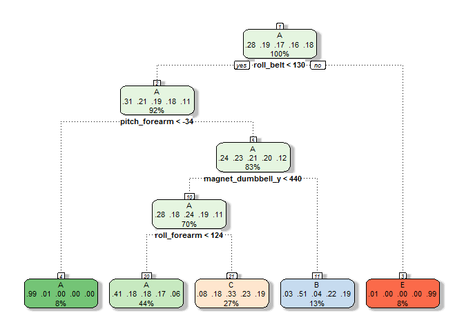
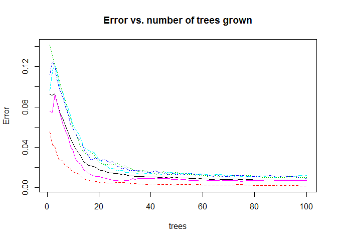
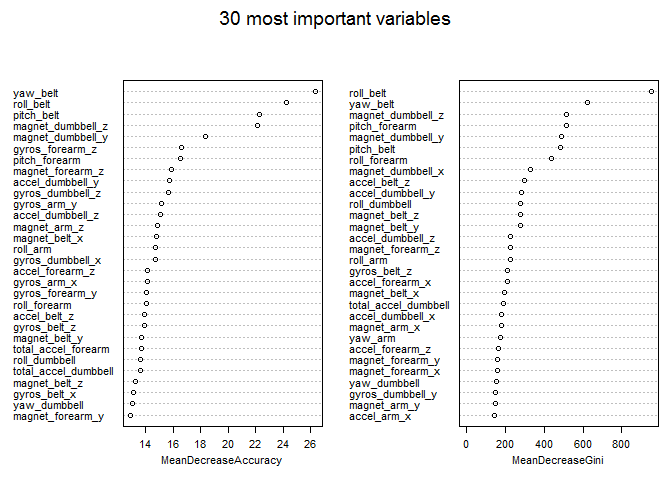

# Predicting how a barbell was lifted


Melissa Tan, Feb 2015, for Coursera predmachlearn-011. Word count: 1547.

## Executive summary

A random forest model was built to predict the way in which a barbell is lifted. In the dataset, 6 people performed barbell lifts correctly and incorrectly, in 5 different ways. Data from accelerometers on their belt, arm, dumbbell, and forearm are used to predict which way they did the exercise.

## Reading in and cleaning data


```r
if (!file.exists("../training.csv")) {
  trainUrl <- "http://d396qusza40orc.cloudfront.net/predmachlearn/pml-training.csv"
  download.file(trainUrl, destfile = "../training.csv")
  }
if (!file.exists("../testing.csv")) {
  testUrl <- "http://d396qusza40orc.cloudfront.net/predmachlearn/pml-testing.csv"
  download.file(testUrl, destfile = "../testing.csv")
  }
training <- read.csv("training.csv", header=TRUE, stringsAsFactors=FALSE, 
                     na.strings=c("", "NA"))  # make blank cells NA
testing <- read.csv("testing.csv", header=TRUE, stringsAsFactors=FALSE, 
                    na.strings=c("", "NA"))  # make blank cells NA
```

Training set is 19622 rows by 160 cols, testing set is 20 rows by 160 cols.

The 5 ways of barbell lifting are stored in the `training$classe` column as __A, B, C, D, E__. ([source](http://groupware.les.inf.puc-rio.br/har)) 

* A: correct way to lift barbell
* B: mistake - throwing the elbows to the front
* C: mistake - lifting the dumbbell only halfway
* D: mistake - lowering the dumbbell only halfway 
* E: mistake - throwing the hips to the fron

There are many columns with NAs.


```r
str(training, list.len=30)  # don't need to show too many
```

```
## 'data.frame':	19622 obs. of  160 variables:
##  $ X                       : int  1 2 3 4 5 6 7 8 9 10 ...
##  $ user_name               : chr  "carlitos" "carlitos" "carlitos" "carlitos" ...
##  $ raw_timestamp_part_1    : int  1323084231 1323084231 1323084231 1323084232 1323084232 1323084232 1323084232 1323084232 1323084232 1323084232 ...
##  $ raw_timestamp_part_2    : int  788290 808298 820366 120339 196328 304277 368296 440390 484323 484434 ...
##  $ cvtd_timestamp          : chr  "05/12/2011 11:23" "05/12/2011 11:23" "05/12/2011 11:23" "05/12/2011 11:23" ...
##  $ new_window              : chr  "no" "no" "no" "no" ...
##  $ num_window              : int  11 11 11 12 12 12 12 12 12 12 ...
##  $ roll_belt               : num  1.41 1.41 1.42 1.48 1.48 1.45 1.42 1.42 1.43 1.45 ...
##  $ pitch_belt              : num  8.07 8.07 8.07 8.05 8.07 8.06 8.09 8.13 8.16 8.17 ...
##  $ yaw_belt                : num  -94.4 -94.4 -94.4 -94.4 -94.4 -94.4 -94.4 -94.4 -94.4 -94.4 ...
##  $ total_accel_belt        : int  3 3 3 3 3 3 3 3 3 3 ...
##  $ kurtosis_roll_belt      : chr  NA NA NA NA ...
##  $ kurtosis_picth_belt     : chr  NA NA NA NA ...
##  $ kurtosis_yaw_belt       : chr  NA NA NA NA ...
##  $ skewness_roll_belt      : chr  NA NA NA NA ...
##  $ skewness_roll_belt.1    : chr  NA NA NA NA ...
##  $ skewness_yaw_belt       : chr  NA NA NA NA ...
##  $ max_roll_belt           : num  NA NA NA NA NA NA NA NA NA NA ...
##  $ max_picth_belt          : int  NA NA NA NA NA NA NA NA NA NA ...
##  $ max_yaw_belt            : chr  NA NA NA NA ...
##  $ min_roll_belt           : num  NA NA NA NA NA NA NA NA NA NA ...
##  $ min_pitch_belt          : int  NA NA NA NA NA NA NA NA NA NA ...
##  $ min_yaw_belt            : chr  NA NA NA NA ...
##  $ amplitude_roll_belt     : num  NA NA NA NA NA NA NA NA NA NA ...
##  $ amplitude_pitch_belt    : int  NA NA NA NA NA NA NA NA NA NA ...
##  $ amplitude_yaw_belt      : chr  NA NA NA NA ...
##  $ var_total_accel_belt    : num  NA NA NA NA NA NA NA NA NA NA ...
##  $ avg_roll_belt           : num  NA NA NA NA NA NA NA NA NA NA ...
##  $ stddev_roll_belt        : num  NA NA NA NA NA NA NA NA NA NA ...
##  $ var_roll_belt           : num  NA NA NA NA NA NA NA NA NA NA ...
##   [list output truncated]
```

Clean up `training` by removing the first 7 columns, since they contain data we don't need. Remove all columns in `training` that contain any NAs. Finally, convert `$classe` to factor.


```r
training <- training[, -c(1:7)]  # remove first 7 cols
keepCols <- colnames(training)[colSums(is.na(training)) == 0]  # keep only cols wth zero NAs
training <- training[, names(training) %in% keepCols]
training$classe <- factor(training$classe)
```

After cleaning, training set is 19622 rows by 53 cols.

## Build prediction model

Split `training` data into `traindf` and `testdf` subsets. We build the model on `traindf` and check its accuracy on `testdf`.


```r
set.seed(0)  # for reproducibility
inTrain <- createDataPartition(y=training$classe, p=0.7, list=FALSE)
traindf <- training[inTrain, ]
testdf <- training[-inTrain, ]
```

Subset dimensions: train subset is 13737 rows by 53 cols, test subset is 5885 rows by 53 cols.

Since there is no immediately obvious linear relationship, we opt for a non-linear approach. Skip principal components analysis which is more suited for linear models.
 
### Build classification tree


```r
modfit.tree <- train(classe ~ ., data=traindf, method="rpart")
fancyRpartPlot(modfit.tree$finalModel, sub="")  # remove subtitle
```

 

```r
confusionMatrix(testdf$classe, predict(modfit.tree, testdf))
```

```
## Confusion Matrix and Statistics
## 
##           Reference
## Prediction    A    B    C    D    E
##          A 1526   21  121    0    6
##          B  482  387  270    0    0
##          C  474   31  521    0    0
##          D  437  170  357    0    0
##          E  174  144  284    0  480
## 
## Overall Statistics
##                                          
##                Accuracy : 0.4952         
##                  95% CI : (0.4823, 0.508)
##     No Information Rate : 0.5256         
##     P-Value [Acc > NIR] : 1              
##                                          
##                   Kappa : 0.3397         
##  Mcnemar's Test P-Value : NA             
## 
## Statistics by Class:
## 
##                      Class: A Class: B Class: C Class: D Class: E
## Sensitivity            0.4934  0.51394  0.33548       NA  0.98765
## Specificity            0.9470  0.85347  0.88343   0.8362  0.88850
## Pos Pred Value         0.9116  0.33977  0.50780       NA  0.44362
## Neg Pred Value         0.6279  0.92288  0.78761       NA  0.99875
## Prevalence             0.5256  0.12795  0.26389   0.0000  0.08258
## Detection Rate         0.2593  0.06576  0.08853   0.0000  0.08156
## Detection Prevalence   0.2845  0.19354  0.17434   0.1638  0.18386
## Balanced Accuracy      0.7202  0.68371  0.60945       NA  0.93808
```

However, accuracy of this tree is quite low. The next model tested, random forest, does much better.

### Build random forest


```r
modfit <- randomForest(classe ~ ., data=traindf, ntree=100, importance=TRUE)
modfit
```

```
## 
## Call:
##  randomForest(formula = classe ~ ., data = traindf, ntree = 100,      importance = TRUE) 
##                Type of random forest: classification
##                      Number of trees: 100
## No. of variables tried at each split: 7
## 
##         OOB estimate of  error rate: 0.72%
## Confusion matrix:
##      A    B    C    D    E class.error
## A 3900    6    0    0    0 0.001536098
## B   15 2631   12    0    0 0.010158014
## C    0   16 2374    6    0 0.009181970
## D    0    0   25 2225    2 0.011989343
## E    0    1    6   10 2508 0.006732673
```

```r
plot(modfit, main="Error vs. number of trees grown", cex=0.7)
```

 

The plot shows that error rate levels out at around 80 trees, so `ntree=100` appears fairly reasonable. The out-of-bag estimate of error rate is also low, at <1%.

The randomForest algorithm can display the most important variables. There are 2 ways of measuring variable importance: mean decrease in accuracy and mean decrease in Gini index. 

 

### Apply model to testing data

Predict `$classe` for `testdf` and check against true values.


```r
confusionMatrix(testdf$classe, predict(modfit, testdf))
```

```
## Confusion Matrix and Statistics
## 
##           Reference
## Prediction    A    B    C    D    E
##          A 1671    2    0    0    1
##          B    2 1135    2    0    0
##          C    0    1 1023    2    0
##          D    0    0    7  957    0
##          E    0    0    0    2 1080
## 
## Overall Statistics
##                                          
##                Accuracy : 0.9968         
##                  95% CI : (0.995, 0.9981)
##     No Information Rate : 0.2843         
##     P-Value [Acc > NIR] : < 2.2e-16      
##                                          
##                   Kappa : 0.9959         
##  Mcnemar's Test P-Value : NA             
## 
## Statistics by Class:
## 
##                      Class: A Class: B Class: C Class: D Class: E
## Sensitivity            0.9988   0.9974   0.9913   0.9958   0.9991
## Specificity            0.9993   0.9992   0.9994   0.9986   0.9996
## Pos Pred Value         0.9982   0.9965   0.9971   0.9927   0.9982
## Neg Pred Value         0.9995   0.9994   0.9981   0.9992   0.9998
## Prevalence             0.2843   0.1934   0.1754   0.1633   0.1837
## Detection Rate         0.2839   0.1929   0.1738   0.1626   0.1835
## Detection Prevalence   0.2845   0.1935   0.1743   0.1638   0.1839
## Balanced Accuracy      0.9990   0.9983   0.9953   0.9972   0.9993
```

Accuracy is high, at nearly 100%.

## Cross-validation and estimating out-of-sample error

Use `rfcv()` function from `library(randomForest)` for k-folds cross validation. It sequentially reduces the number of predictors, by a step multiplier (<1), and computes the cross-validation out-of-sample error each round.


```r
## get the most important predictors by mean decrease in accuracy.
vimp <- importance(modfit)  # evaluates variable importance
vimp <- as.data.frame(vimp[, -(1:5)])  # remove unneeded cols
vimp <- vimp[order(vimp$MeanDecreaseAccuracy, decreasing=TRUE), ]  # most to least impt
mostimp <- head(rownames(vimp), 20)  # choose the 20 most important predictors
## feed the predictors into rfcv.
traindf.trim <- traindf[, names(traindf) %in% mostimp]
modfit.cv <- rfcv(trainx=traindf.trim,    # predictor variables
                  trainy=traindf$classe,  # outcome variable
                  step = 0.8,             # reduction multiplier
                  cv.fold=5)              # number of k-folds
modfit.cv$error.cv
```

```
##          20          16          13          10           8           7 
## 0.008007571 0.009026716 0.010628230 0.013394482 0.018271821 0.017689452 
##           5           4           3           2           1 
## 0.044405620 0.060493558 0.109849312 0.357356046 0.611487224
```

The top row of the output represents the number of predictors used. The bottom row represents the cross-validation out-of-sample error for that number of predictors. The out-of-sample error rate is <5% once there are 5-7 (or more) predictors. If we want to rebuild the model to make it faster, it'd be enough to use about 10 predictors, since the error levels off at about 1% in that region. 

## Final answers

Predict `$classe` for the actual `testing` data.


```r
pred.test <- predict(modfit, testing)
answers <- as.matrix(pred.test)
answers
```

```
##    [,1]
## 1  "B" 
## 2  "A" 
## 3  "B" 
## 4  "A" 
## 5  "A" 
## 6  "E" 
## 7  "D" 
## 8  "B" 
## 9  "A" 
## 10 "A" 
## 11 "B" 
## 12 "C" 
## 13 "B" 
## 14 "A" 
## 15 "E" 
## 16 "E" 
## 17 "A" 
## 18 "B" 
## 19 "B" 
## 20 "B"
```

Prediction accuracy: 20/20 according to auto-grading.

#### end
