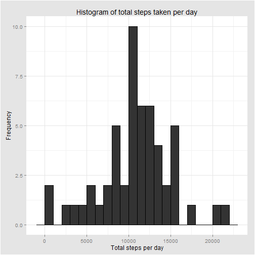
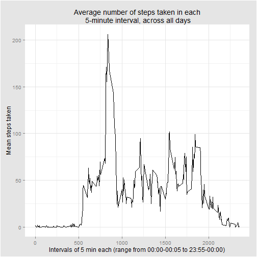
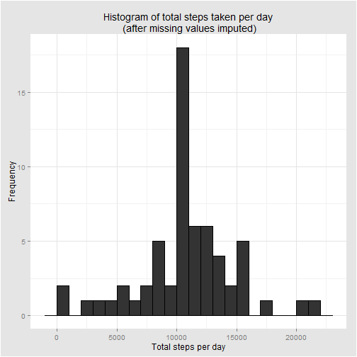
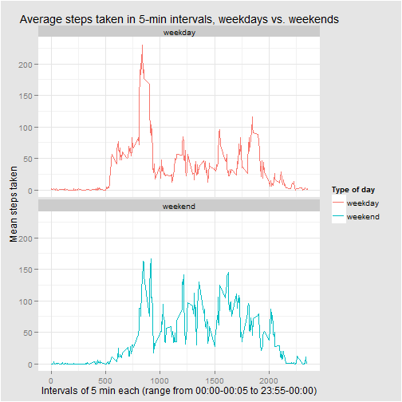

Done by: Melissa Tan, October 2014

## Background

This script analyzes data from a personal activity monitoring device, that collects data at 5-minute intervals throughout the day. 

The data contains the number of steps taken in 5-minute intervals each day. It was collected from an anonymous individual, during October to November 2012 (two months).


## 1. Loading and preprocessing the data

#### 1.1. Load the data

First, fork the Github repo at [https://github.com/rdpeng/RepData_PeerAssessment1](https://github.com/rdpeng/RepData_PeerAssessment1). Clone the repo into current working directory with `git clone https://github.com/[username]/RepData_PeerAssessment1` (replace `[username]` with your own Github username).

The dataset is in a CSV file, `"activity.csv"`, which is found inside the `"activity.zip"` folder within the repo. Set the repo folder as the current working directory, and unzip `"./activity.zip"` contents into it.

```r
unzip("./activity.zip")
```

Read the dataset into R, as a dataframe named `df`. Then, remove the CSV file from working directory since we won't need it anymore.

```r
# Read CSV. stringsAsFactors=TRUE by default, which is OK in this case.
df <- read.csv("./activity.csv", header=TRUE)
# Remove unnecessary file once we're done.
unlink("./activity.csv")
str(df) # Note the NAs, which we will filter out later
```

```
## 'data.frame':	17568 obs. of  3 variables:
##  $ steps   : int  NA NA NA NA NA NA NA NA NA NA ...
##  $ date    : Factor w/ 61 levels "2012-10-01","2012-10-02",..: 1 1 1 1 1 1 1 1 1 1 ...
##  $ interval: int  0 5 10 15 20 25 30 35 40 45 ...
```

```r
head(df) # See that first interval in the day is 00:00-00:05
```

```
##   steps       date interval
## 1    NA 2012-10-01        0
## 2    NA 2012-10-01        5
## 3    NA 2012-10-01       10
## 4    NA 2012-10-01       15
## 5    NA 2012-10-01       20
## 6    NA 2012-10-01       25
```

```r
tail(df) # Last interval in the day is 23:55-00:00
```

```
##       steps       date interval
## 17563    NA 2012-11-30     2330
## 17564    NA 2012-11-30     2335
## 17565    NA 2012-11-30     2340
## 17566    NA 2012-11-30     2345
## 17567    NA 2012-11-30     2350
## 17568    NA 2012-11-30     2355
```

```r
summary(df$steps)
```

```
##    Min. 1st Qu.  Median    Mean 3rd Qu.    Max.    NA's 
##     0.0     0.0     0.0    37.4    12.0   806.0    2304
```

#### 1.2. Libraries needed to process the data (see Notes below for package versions):

```r
# Set message=FALSE to suppress the package loading messages.
require(dplyr)
require(ggplot2)
require(ggthemes)
require(lubridate)
```
## 2. What is mean total number of steps taken per day?

For this part, we can ignore the missing values in the dataset, as instructed. We filter them out using `filter()` from `library(dplyr)`.

```r
df_complete <- df %>% filter(complete.cases(df))
head(df_complete) # df_complete contains no NAs
```

```
##   steps       date interval
## 1     0 2012-10-02        0
## 2     0 2012-10-02        5
## 3     0 2012-10-02       10
## 4     0 2012-10-02       15
## 5     0 2012-10-02       20
## 6     0 2012-10-02       25
```

#### 2.1. Make a histogram of the total number of steps taken each day.
After stripping out missing values, sum up total `$steps`, grouped by `$date`. To do this, we use `group_by()` and `summarize()` from `library(dplyr)`.


```r
steps_by_date <- df_complete %>% group_by(date) %>% summarize(stepsTotal = sum(steps)) # adds new column called "stepsTotal"
head(steps_by_date)
```

```
## Source: local data frame [6 x 2]
## 
##         date stepsTotal
## 1 2012-10-02        126
## 2 2012-10-03      11352
## 3 2012-10-04      12116
## 4 2012-10-05      13294
## 5 2012-10-06      15420
## 6 2012-10-07      11015
```

Create histogram with `library(ggplot2)`. To make the graph look better, I've added a custom theme from `library(ggthemes)`.


```r
# Plot frequency count of total steps per day. Add black border lines to bars in the histogram, set bin width to 1000.
g1 <- ggplot(steps_by_date, aes(stepsTotal)) + geom_histogram(color="black", binwidth = 1000)
# Add labels
g1 <- g1 + labs(x="Total steps per day", y="Frequency", title="Histogram of total steps taken per day") 
# Print the plot, with a custom theme from ggthemes
g1 + theme_igray()
```

 

#### 2.2. Calculate and report the mean and median total number of steps taken per day.


```r
mean(steps_by_date$stepsTotal)
```

```
## [1] 10766
```

```r
median(steps_by_date$stepsTotal)
```

```
## [1] 10765
```

Sanity check: Around 10,000 steps a day sounds like a reasonable number for a healthy individual. (Though I note here that this person takes way more steps on average per day than I do, probably because I'm stuck at home all day doing my Coursera homework.)

## 3. What is the average daily activity pattern?

#### 3.1. Make a time series plot (i.e. `type = "l"`) of the 5-minute interval (x-axis) and the average number of steps taken, averaged across all days (y-axis).

Here, we are still using the complete dataset with missing values stripped out, which was named `df_complete`. Get the average number of steps for each interval, again using `library(dplyr)` functions. No need to convert `$interval` to Factor.

```r
avg_steps_interval <- df_complete %>% group_by(interval) %>% summarize(stepsAverage = mean(steps)) # adds a new column called "stepsAverage"
head(avg_steps_interval)
```

```
## Source: local data frame [6 x 2]
## 
##   interval stepsAverage
## 1        0      1.71698
## 2        5      0.33962
## 3       10      0.13208
## 4       15      0.15094
## 5       20      0.07547
## 6       25      2.09434
```

Now we can plot the time series of average steps (y-axis) against interval (x-axis), again with `library(ggplot2)`. (NB. if `$interval` were a Factor, we would need to add `group=1` as a argument to `aes()` in order to connect each point with a single line. So let's just simply keep `$interval` as type integer.)

```r
# Plot time series line.
g2 <- ggplot(avg_steps_interval, aes(x=interval, y=stepsAverage)) + geom_line()
# Add labels
g2 <- g2 + labs(x="Intervals of 5 min each (range from 00:00-00:05 to 23:55-00:00)", y="Mean steps taken", title="Average number of steps taken in each\n 5-minute interval, across all days")
g2 + theme_igray()
```

 

#### 3.2. Which 5-minute interval, on average across all the days in the dataset, contains the maximum number of steps?

```r
avg_steps_interval[which.max(avg_steps_interval$stepsAverage),]
```

```
## Source: local data frame [1 x 2]
## 
##     interval stepsAverage
## 104      835        206.2
```
We see that the 5-minute interval from *08:35 to 08:40* in the morning contains the maximum number of steps on average, across all the days in the dataset.

##4. Imputing missing values

#### 4.1. Calculate and report the total number of missing values in the dataset (i.e. the total number of rows with `NA`s).

```r
summary(df)
```

```
##      steps               date          interval   
##  Min.   :  0.0   2012-10-01:  288   Min.   :   0  
##  1st Qu.:  0.0   2012-10-02:  288   1st Qu.: 589  
##  Median :  0.0   2012-10-03:  288   Median :1178  
##  Mean   : 37.4   2012-10-04:  288   Mean   :1178  
##  3rd Qu.: 12.0   2012-10-05:  288   3rd Qu.:1766  
##  Max.   :806.0   2012-10-06:  288   Max.   :2355  
##  NA's   :2304    (Other)   :15840
```
This shows us that there are *2304* `NA`s in the dataset in total. 

Let's calculate that again by another method, this time focusing on missing values of `$steps`.

```r
sum(is.na(df$steps))
```

```
## [1] 2304
```
We can thus confirm that the dataset has *2304* rows containing `NA`s.

#### 4.2. Devise a strategy for filling in all of the missing values in the dataset. The strategy does not need to be sophisticated. For example, you could use the mean/median for that day, or the mean for that 5-minute interval, etc.

There are some days, e.g. "2012-10-01", where all the values are `NA`s, so the mean steps for that day would just be `NA` as well. So that's probably not the best strategy to use.

Instead, let's use a different strategy. We will fill in the `NA`s with the *mean for that particular 5-minute interval, across all days*. We already obtained this data above, in `avg_steps_interval`.

#### 4.3. Create a new dataset that is equal to the original dataset but with the missing data filled in.

How our strategy works:
* For each row in the original `df` dataset, if the row contains `NA`, we look in the `avg_steps_interval` dataframe for the corresponding `$interval`. 
* Then, we replace the `NA` with a corresponding `$stepsAverage` value for that interval.

```r
df_new <- df # instead of overwriting df, safer to create copy
for (i in 1:nrow(df_new)) {
    # check if steps == NA for row i
    if (is.na(df_new[i,]$steps)) {
        # if NA, get the corresponding interval value for row i
        corr_int <- df_new[i,]$interval
        # use corresponding interval to find corresponding row
        corr_index <- with(avg_steps_interval, which(interval==corr_int))        
        corr_row <- avg_steps_interval[corr_index,]
        # replace NA with corresponding average steps value
        df_new[i,]$steps <- corr_row$stepsAverage        
    }
}
```
Do a quick check to make sure that the code worked.

```r
head(df_new) # We can see that the NAs have been filled in.
```

```
##     steps       date interval
## 1 1.71698 2012-10-01        0
## 2 0.33962 2012-10-01        5
## 3 0.13208 2012-10-01       10
## 4 0.15094 2012-10-01       15
## 5 0.07547 2012-10-01       20
## 6 2.09434 2012-10-01       25
```

```r
sum(is.na(df_new$steps)) # Just to confirm NAs have been eliminated.
```

```
## [1] 0
```
The result of filling in the original dataset's missing values is `df_new`.

#### 4.4a. Make a histogram of the total number of steps taken each day

Repeat steps from Section 2.1 above, but on `df_new` this time.


```r
# Summarize the total steps taken each day
steps_by_date_new <- df_new %>% group_by(date) %>% summarize(stepsTotal = sum(steps)) 
# Plot histogram with same parameters as in Section 2.1
g3 <- ggplot(steps_by_date_new, aes(stepsTotal)) + geom_histogram(color="black", binwidth = 1000)
# Add labels
g3 <- g3 + labs(x="Total steps per day", y="Frequency", title="Histogram of total steps taken per day\n (after missing values imputed)")
# Print the plot, with a custom theme from ggthemes
g3 + theme_igray()
```

 

#### 4.4b. Calculate and report the mean and median total number of steps taken per day. Do these values differ from the estimates from the first part of the assignment? What is the impact of imputing missing data on the estimates of the total daily number of steps?

Repeat steps from Section 2.2 above, again with `df_new`.

```r
mean(steps_by_date_new$stepsTotal)
```

```
## [1] 10766
```

```r
median(steps_by_date_new$stepsTotal)
```

```
## [1] 10766
```

* Mean from the first part was also 10766, so there was no difference. This makes sense because we filled in the missing data using values for the mean number of steps. Therefore, days which previously had `$stepsTotal` == `NA` now have `$stepsTotal` == mean(`$stepsTotal`).

* Median from the first part was 10765, so there was a slight difference. We see that imputing missing values using the abovementioned strategy caused a slightly higher median. However, the difference is quite small. It is roughly equivalent to `1/10765`, which R computes to be 9.2894 &times; 10<sup>-5</sup>.


## 5. Are there differences in activity patterns between weekdays and weekends?

For this part, one way to do it is to use the `weekdays()` function on the dataset with the filled-in missing values, `df_new`. 

However, I am instead going to use `library(lubridate)` for convenience. The `ymd()` method in the package can easily parse dates, and the `wday()` method returns the day of the week. 

#### 5.1 Create a new factor variable in the dataset with two levels - "weekday" and "weekend" indicating whether a given date is a weekday or weekend day.

To create a new Factor column in `df_new` (ie. the data with missing values imputed), we use `mutate()` from `library(dplyr)`. In the arguments to `wday()`, we set `label=TRUE` so that it prints a string e.g. "Sun" rather than a number e.g. "1".

```r
# Add a column to say which day of the week it is.
df_day <- mutate(df_new, day = wday(ymd(date),label=TRUE))
```

To make a column containing the day type, we use the ternary operator, `ifelse()`. It checks whether `day == "Sat" | day == "Sun`. It returns "weekend" if `TRUE`, and "weekday" if `FALSE`. 

```r
# Add another column, dayType, to say whether it is a weekday or weekend.
df_daytype <- mutate(df_day, dayType = ifelse((day=="Sat"|day=="Sun"), "weekend", "weekday"))
# Convert the new column to Factor
df_daytype <- transform(df_daytype, dayType = factor(dayType)) 
# See result to confirm that the column is now Factor type
str(df_daytype)
```

```
## 'data.frame':	17568 obs. of  5 variables:
##  $ steps   : num  1.717 0.3396 0.1321 0.1509 0.0755 ...
##  $ date    : Factor w/ 61 levels "2012-10-01","2012-10-02",..: 1 1 1 1 1 1 1 1 1 1 ...
##  $ interval: int  0 5 10 15 20 25 30 35 40 45 ...
##  $ day     : Ord.factor w/ 7 levels "Sun"<"Mon"<"Tues"<..: 2 2 2 2 2 2 2 2 2 2 ...
##  $ dayType : Factor w/ 2 levels "weekday","weekend": 1 1 1 1 1 1 1 1 1 1 ...
```

#### 5.2 Make a panel plot containing a time series plot (i.e. type = "l") of the 5-minute interval (x-axis) and the average number of steps taken, averaged across all weekday days or weekend days (y-axis).

First we compute the mean number of steps taken for each interval, averaged across all `weekday`s or `weekend`s. To do that, we use `library(dplyr)` again, calling `group_by()` on `$dayType` and then `$interval`. Then we `summarize()` to obtain the average steps.

```r
avg_steps_interval_daytype <- df_daytype %>% group_by(dayType, interval) %>% summarize(stepsAverage = mean(steps))
head(avg_steps_interval_daytype)
```

```
## Source: local data frame [6 x 3]
## Groups: dayType
## 
##   dayType interval stepsAverage
## 1 weekday        0      2.25115
## 2 weekday        5      0.44528
## 3 weekday       10      0.17317
## 4 weekday       15      0.19790
## 5 weekday       20      0.09895
## 6 weekday       25      1.59036
```

```r
tail(avg_steps_interval_daytype)
```

```
## Source: local data frame [6 x 3]
## Groups: dayType
## 
##     dayType interval stepsAverage
## 571 weekend     2330       1.3880
## 572 weekend     2335      11.5873
## 573 weekend     2340       6.2877
## 574 weekend     2345       1.7052
## 575 weekend     2350       0.0283
## 576 weekend     2355       0.1344
```

Now that we have the data, in narrow form, we can plot it into a two-panel graph, split by `$dayType`.

```r
# Plot line of stepsAverage on y-axis against interval on x-axis
g4 <- ggplot(avg_steps_interval_daytype, aes(x=interval, y=stepsAverage, color=dayType)) + geom_line()
# Make it multi-panel split by dayType, with two rows
g4 <- g4 + facet_wrap(~dayType, nrow=2)
# Add labels
g4 <- g4 + labs(x="Intervals of 5 min each (range from 00:00-00:05 to 23:55-00:00)", y="Mean steps taken", title="Average steps taken in 5-min intervals, weekdays vs. weekends")
# Modify legend
g4 <- g4 + scale_color_discrete(name="Type of day")
g4 + theme_igray()
```

 

## Notes

Software environment in which the analysis was conducted:

* R version 3.1.1
* RStudio version 0.98.1073
* OS: Windows 7, 32-bit
* Packages loaded (non-base packages):
    * dplyr_0.2
    * ggplot2_1.0.0 
    * ggthemes_1.7.0 
    * lubridate_1.3.3
* The above packages depended on:
    * assertthat_0.1   
    * colorspace_1.2-4
    * digest_0.6.4     
    * grid_3.1.1      
    * gtable_0.1.2     
    * MASS_7.3-33     
    * memoise_0.2.1    
    * munsell_0.4.2   
    * parallel_3.1.1   
    * plyr_1.8.1      
    * proto_0.3-10    
    * Rcpp_0.11.2     
    * reshape2_1.4    
    * scales_0.2.4    
    * stringr_0.6.2   
    * tools_3.1.1  

#### End of analysis. Thanks for reading! 
